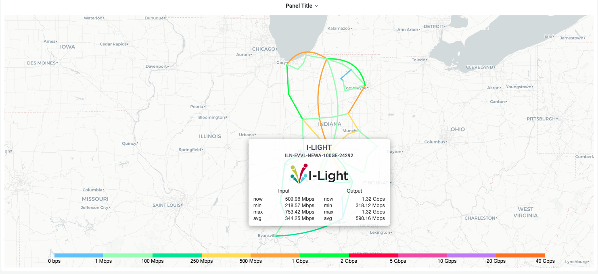
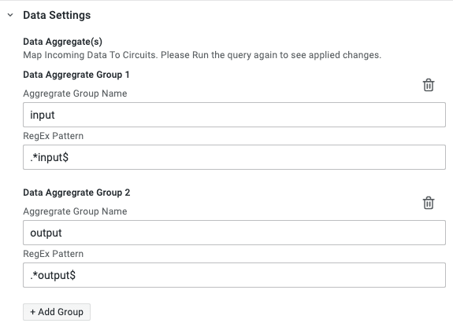

# Add Data To Circuits

The **GlobalNOC Worldvie Panel** allows multiple data points to be mapped to a particular circuit which can then be displayed on its tooltip like this example below:



In the example above, the tooltip has two different metrics applied to it namely `Input` and `Output`. Let's walk through how to apply these datapoints to a worldview map.

All grafana datasources send the panel an array of datapoints like the example below:

```json
[
  {
    "name": "hostname.a.b.c+interfaceET-12+input",
    "datapoints": [[1856397.26666666, 1633959000], [1650972.84444445, 1633958640], [1373735.42222222, 1633958280],…] 
  },
  {
    "name": "hostname.a.b.c+interfaceGE-42+input",
    "datapoints": [[1856397.26666666, 1633959000], [1650972.84444445, 1633958640], [1373735.42222222, 1633958280],…] 
  },
  {
    "name": "hostname.a.b.c+interfaceET-12+output",
    "datapoints": [[19015224.4666666, 1633959000], [16855873.2777778, 1633958640], [15234882.4222223, 1633958280],…] 
  },
  {
    "name": "hostname.d.e.f+interfaceET-45+input",
    "datapoints": [[986576809.333332, 1633959000], [913103824.399999, 1633958640], [890706239.466668, 1633958280],…] 
  },
  ...
]
```

To apply say the first two data points from the example above, the circuit map json should look something like this:

```json
"adjacencies": [
  ...,
  {
    "id": "O2LPdq", // Circuit ID
    "anchors": [
      // Circuit Path Anchors (This example shows a Cubic [C] bezier curve)
      // That will be drawn with the anchors below between Chicago and Amsterdam
      "C",
      [62.42273329229529, -79.98046875000001],
      [67.73918797934685, -13.183593750000002]
    ],
    "a": "8PrAEX", // Chicago Endpoint ID
    "b": "0ZUNVC", // Amsterdam Endpoint ID
    "label": "Chicago - Amsterdam", // Circuit Label
    "metadata": {
      // Circuit specific metadata
      "data_targets": [
        "hostname.a.b.c+interfaceET-12+input", // Will be used to calculate circuit `Input`
        "hostname.a.b.c+interfaceGE-42+input", // Will be used to calculate circuit `Input`
        "hostname.a.b.c+interfaceET-12+output" // Will be used to calculate circuit `Output`
      ] 
    },
    "min": 0, // Minimum Circuit Speed
    "max": 10000000000 // Maximum Circuit Speed
  },
  ...
],
...
```

Each circuit should have a `metadata.data_targets` property on it that will be an list of the exact target names of the datapoints it expects to receive from its respective datasource.

Once the `data_targets` property has been set correctly, Head on over to the panel settings to divide the datapoints that will be mapped to the circuits into two groups: `Input` and `Output`. Open the `Data Settings` tab on the panel settings sidebar and add these two aggregate groups:



Setting these aggregate groups will now map the `data_targets` names that end with `input` `(hostname.a.b.c+interfaceET-12+input, hostname.a.b.c+interfaceGE-42+input)` to the `Input` group and names that end with `output` `(hostname.a.b.c+interfaceET-12+input)` to the `Output` group
