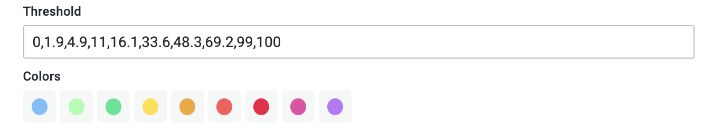
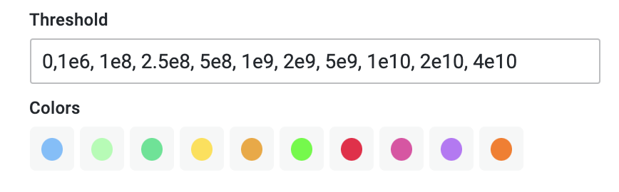

# Configure The Legend

Setting the map legend options will help color the circuits on the map based on the values the panel receives from the connected datasource.

## Legend Types

There are currently two ways a circuit can be colored:

### Absolute Legend

When an absolute legend type is chosen, the circuits are colored based on the values it receives. For example, if the data source shows that a circuit is carrying data at `1`mbps, then the circuit will be colored based on the 1mbps threshold value.

### Percent Legend

This legend type can be used to circuit utilization percentage. This legend type calculates the circuit data utilization % by looking at the current value it has and comparing it with the `max` property on the circuit JSON. For example, a circuit carrying `1`mbps data with a `max` bandwidth of `100`mbps will be colored based on the 1% threshold value.

### Threshold and Colors

Thresholds can be used to color circuits based on the values they receive.

When the legend type selected is of type `Percent`, the thresholds value should look like the example below:

**Explanation:** Setting these threshold values would mean that if a circuit is carrying data at 15mbps and the and its `max` (property) bandwidth is set at 100mbps then the circuit would be colored a light yellow color.

When the legend type selected is of type `Absolute`, the thresholds value should look like the example below:

**Explanation:** Setting these threshold values would mean that if a circuit is carrying data at 15mbps (1.5e7 bps) and then the circuit would be colored a pale green color.
