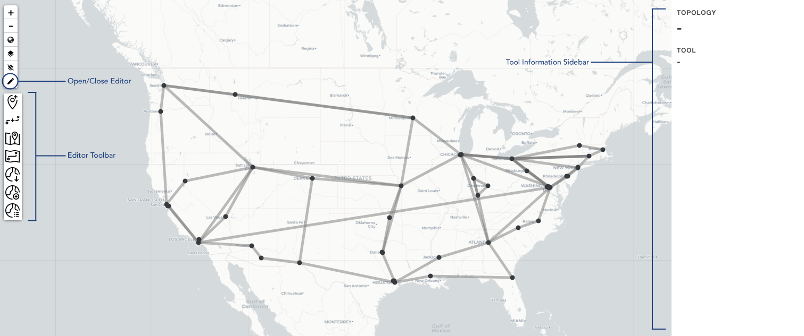
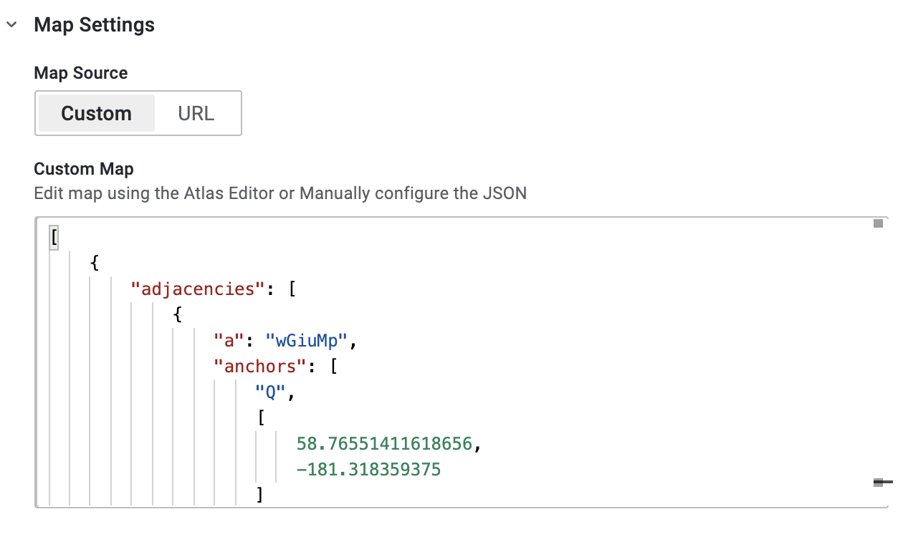

# Create a Custom Map

To create a map inside the dashboard locally, open the `Map Settings` tab and select the `Custom` button. There are two ways to create a custom map.

## Map Editor UI

Clicking on the pen  in the upper right corner toggles the atlas editor. The toolbar displays the set of all tools available to edit a map:

|                                      Icon                                      | Tool          | Description                   |
| :----------------------------------------------------------------------------: | ------------- | ----------------------------- |
|       | Add Node      | Add new nodes to the map      |
|       | Add Circuit   | Add new circuits to the map   |
|      | Edit Node     | Edit existing nodes           |
|      | Edit Lines    | Edit existing circuits        |
|       | Get JSON      | Get Atlas4 formatted map JSON |
|       | Set Topology  | Import map from JSON          |
|  | Edit Topology | Edit Topology Features        |

These tools can be used to create new nodes and circuits for the map. Additional details about each tool should be present on the right sidebar when any tool is selected.

## Paste Map JSON

Raw map JSON can also be pasted directly in the code editor window in the panel sidebar. The map should automatically update if the map JSON is valid.

