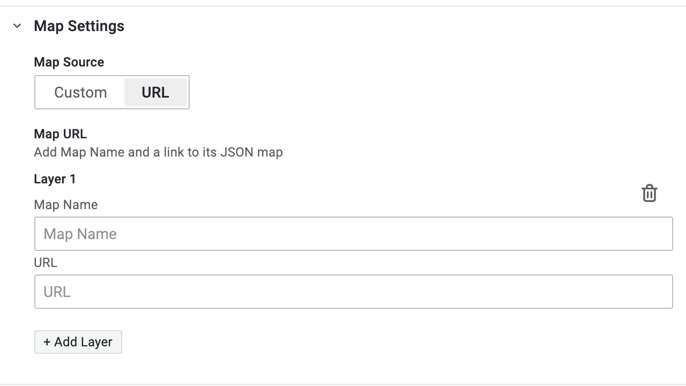

# Link External Maps

Multiple maps can be added from external links by selecting the `URL` options under the `Map Settings` tab. Click on `+ Add Layer` to add a new map layer. The `Name` field can be used to give a name to the map, The URL field will expect a link to the Worldview map JSON.

