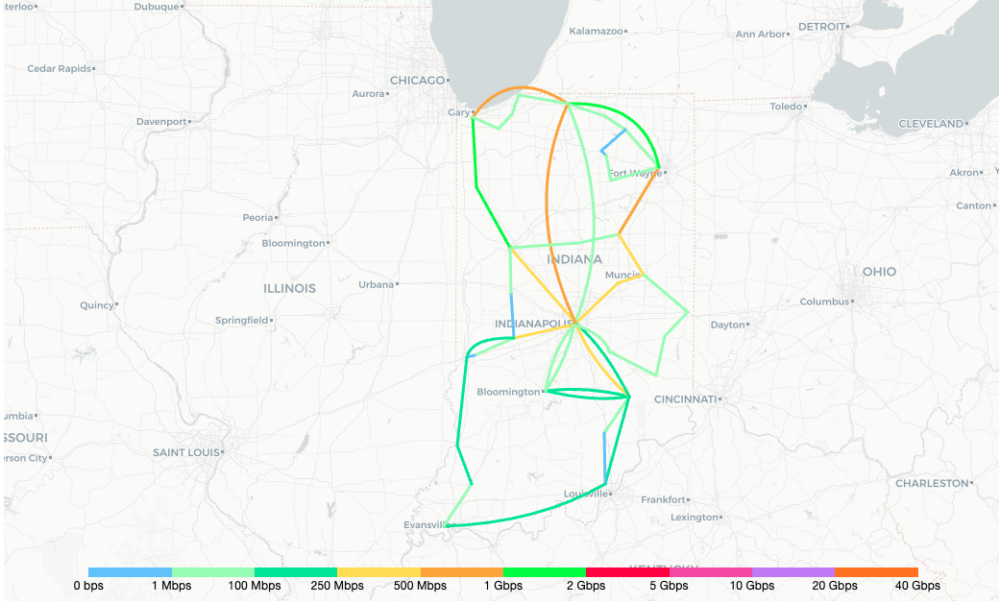

# Introduction
## Network Map Panel for Grafana
The Worldview Panel is a world map that provides the ability to monitor and visualize realtime traffic statistics. It uses timeseries data to represent traffic between nodes as circuits. It provides this information when hovered over the circuits and nodes.

## Features
The Network Map Panel also provides the ability to configure different map options and display options. 